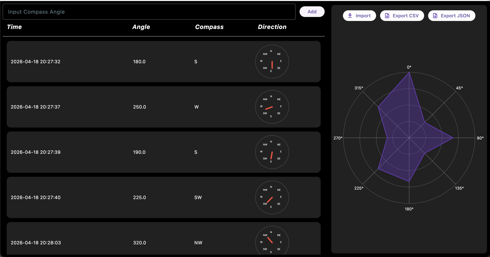

# Compass Tracker

Compass Tracker is a Flutter application for logging, visualizing, and analyzing directional angle readings. It allows users to enter compass angles, review them in a structured table, and view directional distribution through a custom spider-web chart.

## Overview

This project was built to demonstrate custom UI development, interactive data visualization, and file import/export workflows in Flutter. Users can log angle readings from 0° to 360°, view each reading with its timestamp and direction label, and export or import data in CSV or JSON format.

## Features

- **Angle logging**
    - Enter any angle from 0° to 360°
    - Add readings manually through the interface
    - Validate input to prevent invalid values

- **Custom compass display**
    - Visual compass widget that reflects directional input
    - Supports all 8 major compass directions

- **Spider-web chart**
    - Groups entries into 8 directional bins
    - Visualizes directional concentration patterns
    - Updates as data changes

- **Import / Export**
    - Import saved angle data from CSV or JSON
    - Export session data as CSV or JSON
    - Native file picker integration for supported platforms

- **Structured data table**
    - Displays timestamp, angle, direction label, and mini compass
    - Makes logged readings easy to review

## Supported Platforms

This project is currently intended for:

- **Web**
- **macOS**

Mobile support is not a current focus for this version of the project.

## Tech Stack

- **Flutter**
- **Dart**
- **file_picker**
- **csv**
- Custom painting with Flutter `CustomPainter`

## Project Structure

```text
lib/
├── constants.dart
├── main.dart
├── models/
│   └── angle_entry.dart
├── screens/
│   └── home_screen.dart
├── services/
│   ├── export_entries.dart
│   └── import_entries.dart
└── widgets/
    ├── angle_entry_list.dart
    ├── sidebar.dart
    ├── compass/
    │   ├── compass_painter.dart
    │   └── display_compass.dart
    └── spiderchart/
        ├── spider_painter.dart
        └── spider_web_chart.dart
```

## Getting Started
### Prerequisites
- Flutter SDK
- Dart SDK
- Chrome installed for web testing
- Xcode tools installed for macOS testing

### Installation
Clone the repository and install dependencies:
```bash
git clone https://github.com/jgerck/compass_tracker.git
cd compass_tracker
flutter pub get
```

### Run on Web
```bash
flutter run -d chrome
```

### Run on macOS
```bash
flutter run -d macos
```

## Usage
### Add Readings
1. Enter the angle between 0 and 360.
2. Press Enter or click Add.
3. The reading will appear in the table and update the chart.

### Import Data
1. Click **Import**.
2. Select a valid CSV or JSON file.
3. Imported entries will populate the table and visualization.

### Export Data
1. Click **Export CSV** or **Export JSON**.
2. Choose a save location.
3. The current session data will be saved in the selected format.

## Spider Chart Behavior
The spider chart groups entries into 8 directional sectors, each covering 45 degrees:
- N
- NE
- E
- SE
- S
- SW
- W
- NW
Each logged angle is placed into the nearest directional bin. This means the chart shows directional distribution by sector, not exact polar coordinates for every individual reading.

## Future Improvements
- Improved responsive layout for smaller screens
- More detailed filtering and sorting
- Expanded chart customization
- Better support for additional platforms

## Screenshots
### Main Dashboard


### Spider Chart Visualization


## Sample Data
Example CSV and JSON files are included in the repository under 'assets/' in the project root for quick testing. These can be imported directly into the app to demonstrate the table, compass widgets, and spider chart behavior.

## License
MIT License